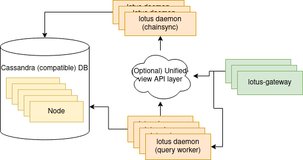

## Creating Scalable Lotus Node Infrastructure with Follower Nodes

Incorporating follower nodes and YugabyteDB provides a solid base for building a durable Lotus Node Infrastructure. The consistent state they provide across all nodes ensures optimal scalability and improved system performance. This unique blend of elements significantly augments infrastructure reliability and efficiency.

## Summary

This proposal aims to create a scalable Lotus infrastructure leveraging YugabyteDB as the backend datastore, supporting multiple RPC nodes behind a load balancer, and supporting linearly being able to increase read IOPs through horizontally scaling and adding more nodes to the Yugabyte cluster. Because of the Yugabyte cluster, all of the RPC nodes will see identical and synchronized chain state.


## Infrastructure Diagram

 



# Local Test Server Setup Instructions

The instructions below guide you in setting up a local test server. This setup aims for scalability, robustness, and distribution. It can be easily extended to a larger, scalable infrastructure.

## Prerequisites

1. Set up standard lotus node prerequisites. Detailed instructions can be found [here](https://lotus.filecoin.io/lotus/install/linux/).

## Setup Instructions

1. **Set up YugabyteDB:**
   - You can download YugabyteDB from [this link](https://download.yugabyte.com/#linux).
   - Execute the following commands:
     ```
     wget https://downloads.yugabyte.com/releases/2.18.0.0/yugabyte-2.18.0.0-b65-linux-x86_64.tar.gz
     tar xvfz yugabyte-2.18.0.0-b65-linux-x86_64.tar.gz && cd yugabyte-2.18.0.0/
     ./bin/post_install.sh
     ./bin/yugabyted start
     ```

2. **Download Mainnet snapshot:**
   - You can download it from [this link](https://lotus.filecoin.io/lotus/manage/chain-management/).
   - Execute the following command:
     ```
     aria2c -x5 https://snapshots.mainnet.filops.net/minimal/latest.zst
     ```

3. **Sync chain:**

   - Create default config:
     ```
     mkdir -p ~/.lotus
     ./lotus config default > ~/.lotus/config.toml
     ```

   - Disable splitstore:
     ```
     EnableSplitstore = false
     ```

   - Import mainnet snapshot data. This process should take approximately 20 minutes:
     ```
     LOTUS_PATH=~/.lotus LOTUS_CASSANDRA_UNIVERSAL_STORE=127.0.1.1:9042 ./lotus daemon --halt-after-import --import-snapshot latest.car.zst 
     ```

   - Start node daemon:
     ```
     LOTUS_PATH=~/.lotus LOTUS_CASSANDRA_UNIVERSAL_STORE=127.0.1.1:9042 ./lotus daemon
     ```

4. **Configure Follower node:**

   - Create the follower node configuration:
     ```
     mkdir -p ~/.lotusfollower
     ./lotus config default > ~/.lotusfollower/config.toml
     ```

   - Update follower config:
     - Disable splitstore
     - Enable eth rpc:
       ```
       EnableEthRPC = true
       ```
     - Change port to 4234 (to not conflict with syncer daemon):
       ```
       ListenAddress = "/ip4/127.0.0.1/tcp/4234/http"
       ```

   - Start follower node:
     ```
     LOTUS_PATH=~/.lotusfollower/ FULLNODE_API_INFO=http://localhost:1234 LOTUS_CASSANDRA_UNIVERSAL_STORE=127.0.1.1:9042 ~/filecoin-project/lotus/lotus daemon --follower
     ```

   - Test that the follower node responds to eth rpc queries:
     ```
     curl http://localhost:4234/rpc/v1 -X POST -H "Content-Type: application/json" --data '{"method":"Filecoin.EthEstimateGas","params":[{"from":"0x08ca94cdD897F4382cb4E83Cb58e976ce06a7E68","to":"0x08ca94cdD897F4382cb4E83Cb58e976ce06a7E68","value":"0x186a0"}],"id":1,"jsonrpc":"2.0"}'
     ```

## Suggested Hardware for Single Node Testing

- 2TB 4.0 NVMe SSD: [980 PRO w/ Heatsink PCIe® 4.0 NVMe™ SSD 2TB](https://www.samsung.com/us/computing/memory-storage/solid-state-drives/980-pro-w-heatsink-pcie-4-0-nvme-ssd-2tb-mz-v8p2t0cw/) ($170)
- 32GB Ram: 4 x [DDR4 8GB 3200MHz](https://www.amazon.com/Patriot-Signature-Line-3200MHz-Single/dp/B0887VLQPB?th=1)  ($76)
- 6 core Intel chip: [Intel Core i5-11400F @ 2.60GHz](https://www.cpubenchmark.net/cpu.php?id=4226&cpu=Intel+Core+i5-11400F+%40+2.60GHz) ($133)


